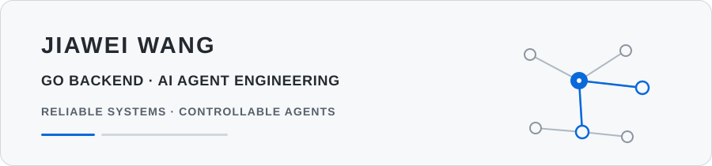

  <picture>
    <source
      media="(prefers-color-scheme: dark)"
      srcset="./assets/profile-header-dark.svg"
    >
    <source
      media="(prefers-color-scheme: light)"
      srcset="./assets/profile-header-light.svg"
    >
    
  </picture>

Master of IT @ Monash University

  <code>Go Backend</code>&nbsp;&nbsp;
  <code>Distributed Systems</code>&nbsp;&nbsp;
  <code>AI Agent</code>

---

## 01 — Featured Projects

<table>
<tr>
<td width="50%" valign="top">
01 · DISTRIBUTED BACKEND
<h3><a href="https://github.com/jiawei-wang-dev/relayim-go">RelayIM-Go</a></h3>

<strong>Distributed real-time messaging backend</strong> 
<code>Go</code> <code>Kafka</code> <code>Redis Stream</code> <code>WebSocket</code>

<strong>CORE DESIGN</strong> 
• Multi-node WebSocket routing with etcd + Redis leases 
• Kafka Store / Route groups + Redis Stream recovery

<strong>RELIABILITY</strong> 
Idempotency · ACK semantics · Offline recovery · Fault testing

<a href="https://github.com/jiawei-wang-dev/relayim-go">Repository →</a>&nbsp;·&nbsp;<a href="https://github.com/jiawei-wang-dev/relayim-go/blob/main/docs/ARCHITECTURE.md">Architecture →</a>

</td>
<td width="50%" valign="top">
02 · AGENT ENGINEERING
<h3><a href="https://github.com/jiawei-wang-dev/WatchOps-Lite">WatchOps-Lite</a></h3>

<strong>Evidence-driven OnCall troubleshooting Agent</strong> 
<code>Go</code> <code>Eino</code> <code>RAG</code> <code>Tool Calling</code>

<strong>CORE DESIGN</strong> 
• Turn Governance + controlled ReAct runtime 
• Hybrid RAG + evidence-bound diagnosis

<strong>QUALITY</strong> 
Agent Harness · Multi-Agent · Evaluation · Replay

<a href="https://github.com/jiawei-wang-dev/WatchOps-Lite">Repository →</a>&nbsp;·&nbsp;<a href="https://github.com/jiawei-wang-dev/WatchOps-Lite#architecture">Architecture →</a>

</td>
</tr>
</table>

## 02 — Stack

**Backend** — `Go` · `go-zero` · `Gin` · `gRPC` · `WebSocket` 
**Data & Messaging** — `MySQL` · `Redis` · `Kafka` · `Redis Stream` · `Elasticsearch` · `etcd` 
**AI Agent** — `Eino` · `RAG` · `Tool Calling` · `Multi-Agent` · `Evaluation` 
**Observability** — `Prometheus` · `Grafana` · `OpenTelemetry` · `Jaeger`

 

  Reliable Systems · Controllable Agents · Observable Execution

## 03 — Contact

[Email](mailto:jwan0624@student.monash.edu) · [GitHub](https://github.com/jiawei-wang-dev)
